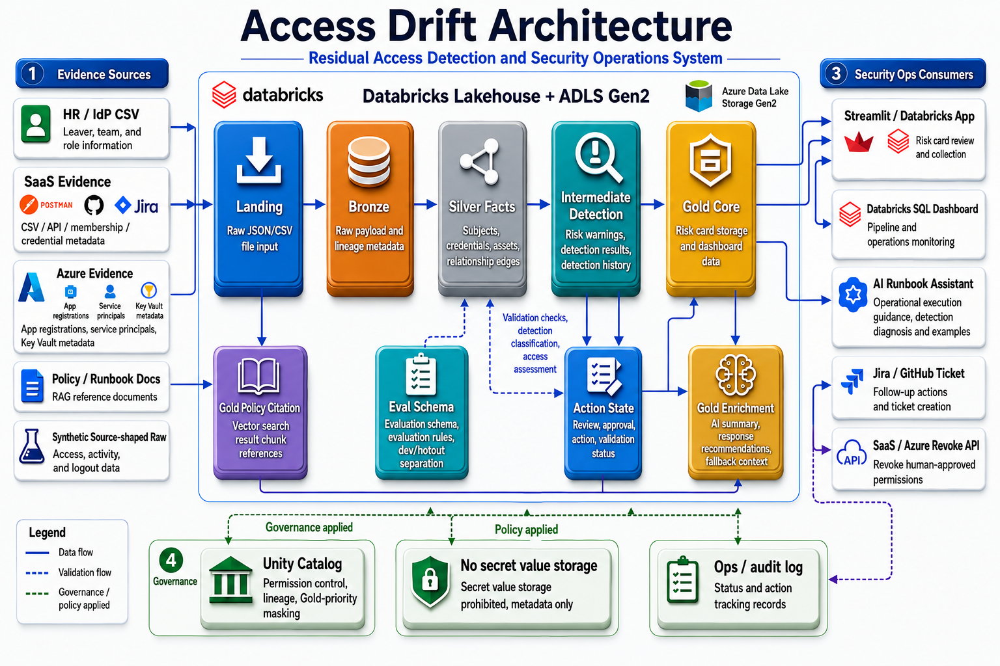

# Access Drift — my contributions

This repository is a curated extract of **my own contributions** to the team project
[dataschool-proj2-team5/access-drift](https://github.com/dataschool-proj2-team5/access-drift),
pulled out into a standalone repo for portfolio purposes. All content has been translated
into English.

Access Drift detects "access drift" — residual access left behind by leavers and
non-human identities (NHIs) — and surfaces it as Risk Cards on a dashboard, with a
Databricks-native RAG layer that generates grounded, cited remediation advice.

> **Note:** this is an extract, not a runnable fork. Some files import shared modules that
> live in the original team repo and are not included here. It's meant to show the code and
> design I authored, not to run end-to-end on its own.

## System architecture

The architecture below shows the end-to-end flow I designed around evidence ingestion,
Databricks Lakehouse processing, risk detection, RAG-based remediation guidance, and
SecOps follow-up actions.

## Portfolio screenshots

### Risk Card dashboard

The Streamlit dashboard presents each detected access drift case as a Risk Card. It shows
the affected NHI, active credential state, sensitive asset path, risk summary, and the
factors that triggered the critical classification.

/Main-Dashboard.png>)

### Databricks workflow pipeline

The Databricks workflow coordinates synthetic evidence generation, migration, DLT
processing, RAG document chunk indexing, evaluation, and gold table publishing. The run
history demonstrates that the pipeline can be operated repeatedly from Databricks Jobs.

/Databricks-pipeline.png>)

### RAG evaluation query

This SQL check summarizes RAG evaluation results by answer source, including retrieval
recall, citation rate, groundedness, and correctness. I used this to validate that
generated remediation guidance stayed grounded in retrieved policy/runbook evidence.

/RAG-SQL.png>)

### Jira ticket detail

Detected findings can be converted into Jira work items with the case ID, risk rationale,
evidence, severity, and recommended action. This screen shows how the analytical output is
translated into an operational follow-up ticket.

/Jiraticket-detail.png>)

## What's mine here

### RAG chain & AI Agent (Databricks-native RAG)
- `notebooks/12_rag_vector_index.ipynb` — Vector Search Delta Sync index over the evidence corpus
- `notebooks/13_rag_chain.ipynb` — gold_core finding → retrieval → grounded recommended action (enforced citations) → `rag.recommended_action`
- `notebooks/14_rag_eval.ipynb` — RAG quality evaluation (retrieval recall / citation rate / groundedness / correctness)
- `notebooks/15_register_external_model_endpoint.ipynb` — External Model endpoint registration (dry-run by default)
- `notebooks/19_rag_llm_serving_smoke.ipynb` — LLM serving smoke check
- `apps/dashboard/src/rag_agent.py` — conversational RAG chatbot for the Risk Card (retrieval + FM LLM, deterministic fallback)
- `sql/databricks/migrations/009_create_rag_chain_tables.sql` — RAG chain output tables
- `data/dev/rag/rag_eval_set.jsonl` — RAG evaluation set

### Dashboard (Streamlit)
- `apps/dashboard/components/risk_text_panels.py` — AI Agent chat panel
- `apps/dashboard/src/data_loader.py` — data loading / Databricks connection
- `apps/dashboard/RUN_LOCAL.md` — local run guide
- `apps/dashboard/.streamlit/secrets.toml.example` — connection secrets template

### Infrastructure & design docs
- `databricks.yml` — Databricks Asset Bundle (jobs, targets, pipelines)
- `infra/databricks/tests/smoke-check.py` — UC CRUD / Delta-format smoke check (a pre-work gate)
- `docs/adr/0002-rag-chain-model-and-fallback.md` — ADR: RAG model choice + deterministic fallback
- `docs/contracts/rag-chain.md` — RAG chain contract
- `docs/design/expansion/` — post-PoC expansion design (label taxonomy, distractor catalogue, time-axis policy)

## Tech stack

Databricks (Unity Catalog, Vector Search, Foundation Model API, Asset Bundles, DLT),
Python, Streamlit, MLflow, SQL / Delta Lake.
